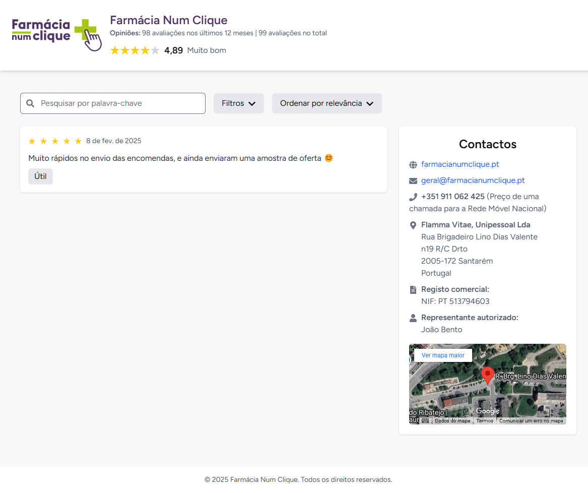
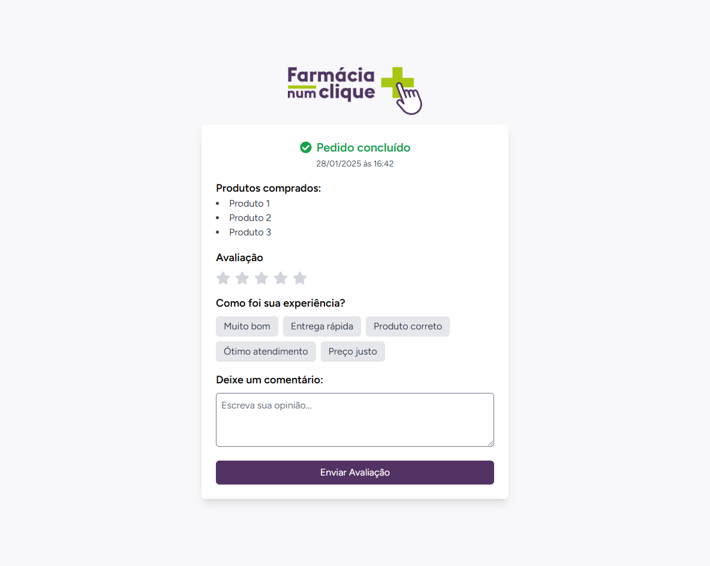
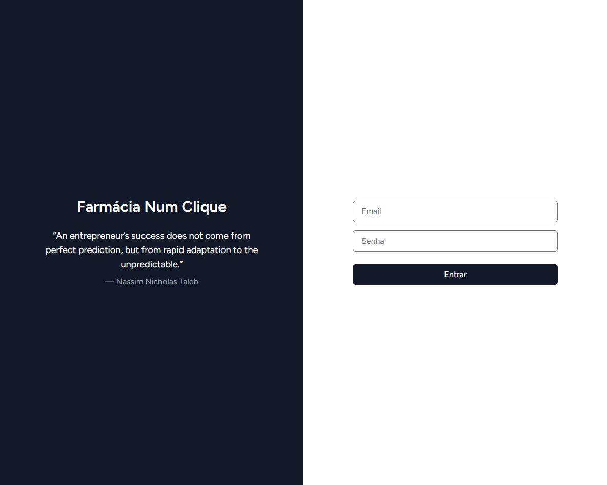
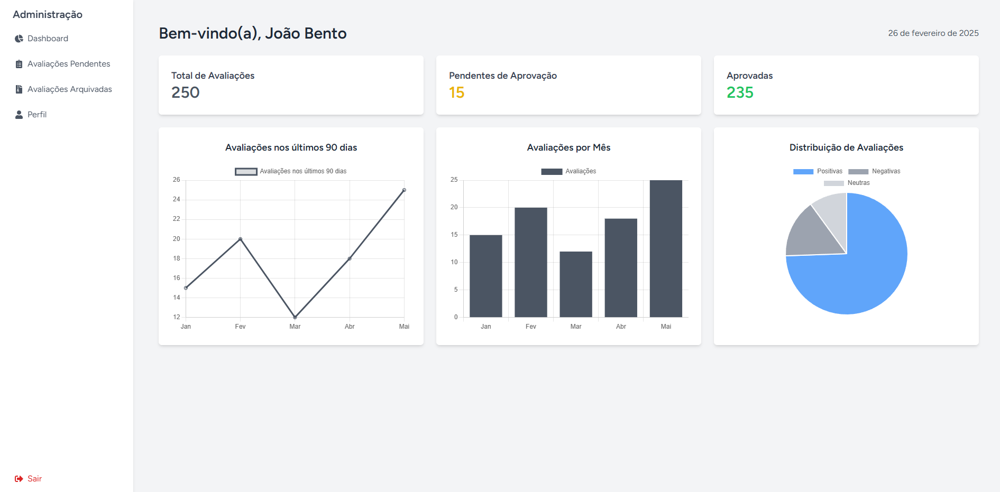
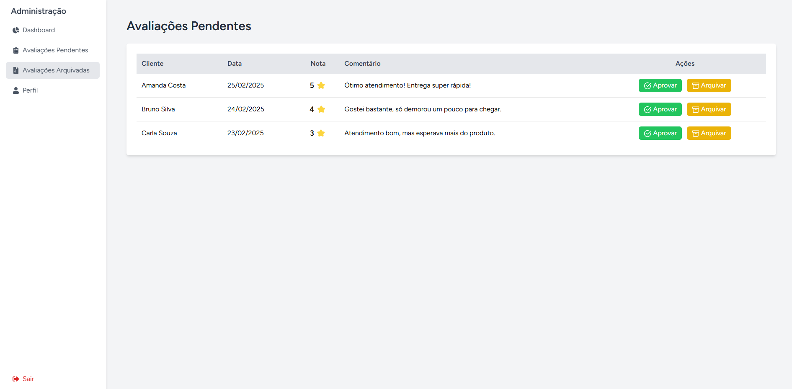
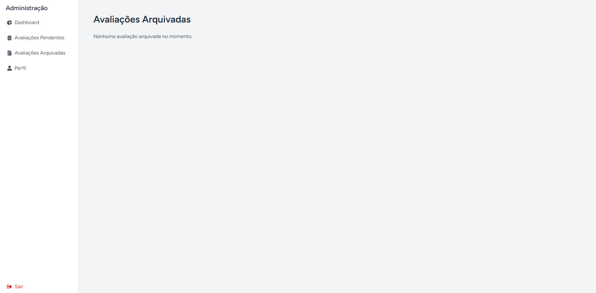

# 🏥 **Farmácia Num Clique - Backoffice**
> **Sistema de gestão de avaliações e usuários para uma farmácia online.**

  
  
  
  

---

## 📌 **Sobre o Projeto**
O **Farmácia Num Clique - Backoffice** é um painel administrativo desenvolvido para gerenciar avaliações de clientes, aprovar ou arquivar feedbacks e gerenciar perfis de usuários de uma farmácia online.

Este projeto foi construído utilizando **Laravel + Inertia.js + React + TailwindCSS**.

---

## 🎯 **Funcionalidades**
✅ Dashboard com gráficos interativos 📊  
✅ Gerenciamento de avaliações pendentes e arquivadas ✏️  
✅ Edição de perfil do administrador ⚙️  
✅ Sistema de login e autenticação 🔐  
✅ Layout responsivo e moderno 📱  

---

## 🛠 **Tecnologias Utilizadas**
- **Laravel** (Framework PHP)
- **Inertia.js** (Para comunicação entre Laravel e React)
- **React** (Interface do usuário)
- **TailwindCSS** (Estilização)
- **Chart.js** (Gráficos interativos)
- **Herd** (Ambiente de desenvolvimento PHP)

---

## 🚀 **Instalação**
### 🔹 **Pré-requisitos**
- PHP 8.x
- Composer
- Node.js + NPM
- Laravel Herd ou Laravel Sail (ou ambiente configurado manualmente)
- MySQL (ou SQLite)

### 🔹 **Passos para rodar o projeto**
1. **Clone o repositório:**  
```bash
git clone https://github.com/seu-usuario/seu-repositorio.git
cd seu-repositorio
```

2. **Instale as dependências:**  
```bash
composer install
npm install
```

3. **Copie o arquivo .env.example e configure:**  
```bash
cp .env.example .env
```
Edite o arquivo **.env** e configure as credenciais do banco de dados.

4. **Gere a chave do Laravel:**  
```bash
php artisan key:generate
```

5. **Execute as migrations e seeds:**  
```bash
php artisan migrate --seed
```

6. **Inicie o servidor:**  
```bash
herd serve
# ou se estiver usando Sail
./vendor/bin/sail up -d
```

7. **Compile os assets front-end:**  
```bash
npm run dev
```

O projeto estará rodando em **http://localhost** 🚀.

---

## 🖼 **Screenshots**

### 🛍️ Página das avaliações


### ⭐ Página para o cliente avaliar a experiência de compra


### 🔐 Login para o Backoffice 


### 📊 Dashboard


### 📝 Avaliações Pendentes


### 📁 Avaliações Arquivadas



---

## 📜 **Licença**
Este projeto é de uso interno e não possui uma licença pública no momento.

---

💙 **Desenvolvido por Amanda Alves** ✨

